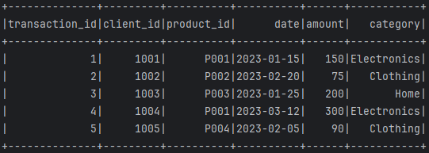
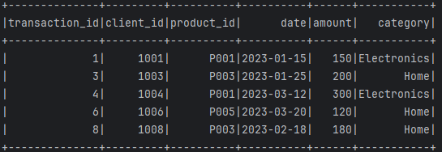
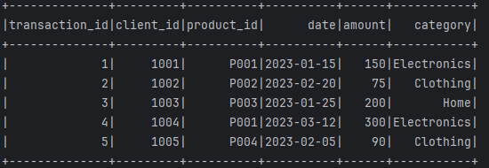
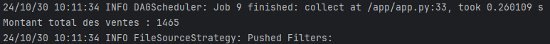
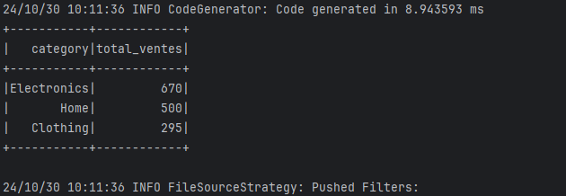
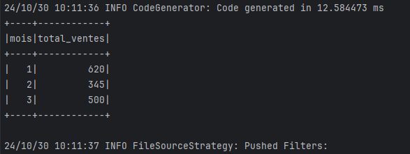
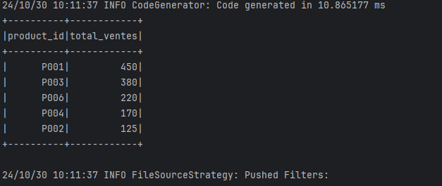
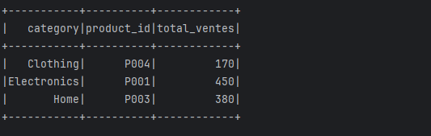

# PySpark Sales Analysis

This project is a sales analysis application built with PySpark, running inside Docker containers. It processes sales data from a CSV file (`ventes.csv`) to perform various analytical tasks, such as calculating total sales, filtering based on specific criteria, and identifying top products by sales amount.

## Prerequisites

- Docker and Docker Compose installed

## Project Structure

- `docker-compose.yml`: Docker configuration file to set up Spark master and worker containers.
- `app.py`: PySpark script to read and analyze the sales data.
- `ventes.csv`: Sample CSV file containing sales data.

## Setup and Execution

### 1. Clone the Repository

Clone this repository to your local machine:

```bash
git clone  https://github.com/Oulakbir/PySpark-sales-analysis.git
cd PySpark-sales-analysis
```

### 2. Prepare the Data

Ensure the `ventes.csv` file is in the project root directory and includes columns as follows:

```csv
transaction_id,client_id,product_id,date,amount,category
1,1001,P001,2023-01-15,150,Electronics
2,1002,P002,2023-02-20,75,Clothing
3,1003,P003,2023-01-25,200,Home
...
```

### 3. Build and Start Docker Containers

To start the Spark master and worker containers, run:

```bash
docker-compose up -d
```

This command will start the containers in detached mode.

### 4. Verify Mounted Files

Check that `app.py` and `ventes.csv` are correctly mounted in the `/app` directory inside the `spark-master` container:

```bash
docker exec -it spark-master ls /app
```

You should see:

```bash
app.py  ventes.csv
```

### 5. Run the PySpark Script

Execute the PySpark script using `spark-submit`:

```bash
docker exec -it spark-master spark-submit /app/app.py
```

### 6. View Results

The output will display analysis results such as:
- Total sales for the period.
- Sales by product category.
- Monthly sales totals.
- Top 5 most sold products by sales amount.

Example output (for illustration):

```plaintext
Total Sales: 1500
Sales by Category: {'Electronics': 600, 'Clothing': 300, 'Home': 600}
Monthly Sales: {'2023-01': 500, '2023-02': 300, '2023-03': 700}
Top 5 Products by Sales Amount: [P001, P003, P006, P002, P004]
```

### 7. Stop Containers

Once you are finished, stop the containers:

```bash
docker-compose down
```

## Results of the execution:

After running the `spark-submit`:

### Filtrez les transactions avec un montant supérieur à un certain seuil (par exemple,100 €):


### Remplacez les valeurs nulles dans les colonnes amount et category par des valeurs par défaut:


### Convertissez la colonne date en un format de date pour permettre des analyses temporelles:


### Calculez le total des ventes pour l'ensemble de la période:


### Calculez le montant total des ventes par catégorie de produit:


### Calculez le montant total des ventes par mois:


### Identifiez les 5 produits les plus vendus en termes de montant total:


### Pour chaque catégorie, trouvez le produit le plus vendu:

